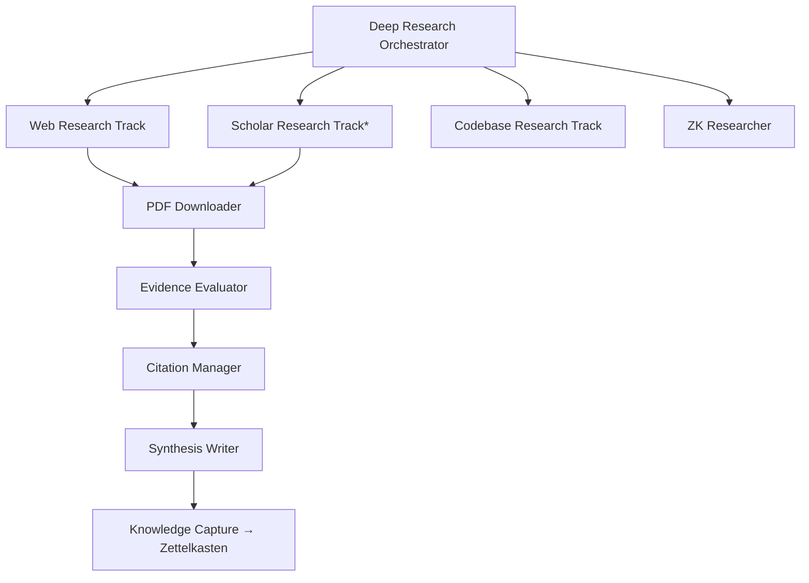

# Deep Research Orchestrator

A multi-source research pipeline using parallel track execution across web, academic papers, codebase, and Zettelkasten knowledge graph. Orchestrates 8 specialized agents through a 6-phase pipeline with evidence evaluation, citation management, and automatic knowledge capture.

## Architecture



> **Note**: `research-scholar-track` requires the Semantic Scholar MCP server. The agent spec is not yet implemented as a standalone file — the orchestrator invokes it by name and the agent must be created separately.

## Agents

| Agent | File | Role | Model |
|-------|------|------|-------|
| `deep-research-orchestrator` | `agents/deep-research-orchestrator.agent.md` | Manager — coordinates all phases | Claude Sonnet 4.6 |
| `research-web-track` | `agents/research-web-track.agent.md` | Tier 2 — Tavily web search | Claude Sonnet 4.6 |
| `research-codebase-track` | `agents/research-codebase-track.agent.md` | Tier 2 — local workspace search | Claude Haiku 4.5 |
| `zk-researcher` | `agents/zk-researcher.agent.md` | Tier 2 — Zettelkasten graph traversal | Claude Sonnet 4.6 |
| `research-pdf-downloader` | `agents/research-pdf-downloader.agent.md` | Phase 2.5 — full-text PDF acquisition | Claude Haiku 4.5 |
| `research-evidence-evaluator` | `agents/research-evidence-evaluator.agent.md` | Tier 3 — CRAAP evaluation + contradictions | Claude Opus 4.6 |
| `research-citation-manager` | `agents/research-citation-manager.agent.md` | Tier 3 — BibTeX + citation network | Gemini 3 Flash |
| `research-synthesis-writer` | `agents/research-synthesis-writer.agent.md` | Tier 3 — narrative + evidence map | Claude Sonnet 4.6 |

## Bundled Skills

All 4 skills are included in the `skills/` directory:

| Skill | Purpose |
|-------|---------|
| `deep-web-research` | Search strategies, evidence hierarchy, arXiv protocol, bookmarking |
| `zettelkasten-management` | Note types, linking patterns, knowledge capture workflows |
| `scientific-brainstorming` | Research agenda generation (Phase 6) |
| `scientific-critical-thinking` | Methodology critique of key papers (Phase 2.5) |

## Pipeline Phases

| Phase | Description | Time |
|-------|-------------|------|
| 1 | Initialization — create state file and stubs | 1-2 min |
| 2 | Parallel track execution (web, scholar, codebase, ZK) | 3-8 min |
| 2.5 | PDF acquisition from scholar track | 2-5 min |
| 3 | Sequential synthesis (evidence → citations → narrative) | 3-6 min |
| 4 | Knowledge capture to Zettelkasten | 1-2 min |
| 5 | Report generation | <1 min |
| 6 | Research agenda (brainstorming) | 1-2 min |
| **Total** | | **10-23 min** |

## Installation

Copy all agents and skills to your workspace:

```bash
# From this directory:
cp agents/*.agent.md /path/to/your/workspace/.github/agents/
cp -r skills/deep-web-research /path/to/your/workspace/.github/skills/
cp -r skills/zettelkasten-management /path/to/your/workspace/.github/skills/
cp -r skills/scientific-brainstorming /path/to/your/workspace/.github/skills/
cp -r skills/scientific-critical-thinking /path/to/your/workspace/.github/skills/
```

## Required MCP Servers

- `zettelkasten` — Knowledge graph (required for ZK track and knowledge capture)
- `tavily` — Web search (required for web track)
- `semanticscholar` — Academic papers (required for scholar track)
- `raindrop` — Bookmark management (optional but recommended)

## Usage

Start the orchestrator from VS Code Copilot Chat:

```
@deep-research-orchestrator research [your question here]
```

Commands: `research X`, `continue`, `deepen`, `status`, `web-only`, `scholar-only`, `retry [track]`
