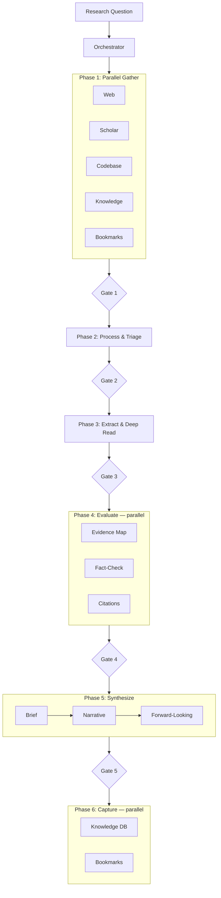

# Deep Research Pipeline v2

Hybrid NW+OPS architecture for modular, multi-agent deep research with quality gates and split sub-artifacts.

## Architecture



## Key Design Decisions

| Decision                                    | Source | Rationale                                                                |
| ------------------------------------------- | ------ | ------------------------------------------------------------------------ |
| Track preservation in `tracks/`             | NW     | Raw data preserved for audit and re-analysis                             |
| Source management split to `sources/`       | OPS    | Explicit filtering decisions + per-source metadata                       |
| Evidence evaluation (CRAAP + claims matrix) | NW     | Rigorous cross-source evidence assessment                                |
| Pacheco-Vega AIC paper analysis             | OPS    | Structured multi-pass academic deep reading                              |
| Forward-looking split (3 files)             | OPS    | Hypotheses, questions, further-research as separate actionable artifacts |
| BibTeX + reading list                       | NW     | Academic citation management                                             |
| Mermaid TB diagrams                         | NW     | Inline rendering, version-control friendly                               |
| draw.io optional                            | Hybrid | Only created on explicit request                                         |
| Sub-artifact splitting                      | New    | No file exceeds ~200 lines                                               |
| Evaluate agent split                        | New    | Evidence map and fact-check as parallel sub-agents                       |
| Synthesize agent split                      | New    | Brief, narrative, forward as separate focused agents                     |

## Folder Structure

```
v2/
├── README.md
├── manifest.yaml
├── agents/                   (16 agents)
│   ├── dk.v2.orchestrator.agent.md
│   ├── dk.v2.gather-web.agent.md
│   ├── dk.v2.gather-scholar.agent.md
│   ├── dk.v2.gather-codebase.agent.md
│   ├── dk.v2.gather-knowledge.agent.md
│   ├── dk.v2.gather-bookmarks.agent.md
│   ├── dk.v2.process.agent.md
│   ├── dk.v2.extract.agent.md
│   ├── dk.v2.evaluate-evidence.agent.md
│   ├── dk.v2.evaluate-factcheck.agent.md
│   ├── dk.v2.cite.agent.md
│   ├── dk.v2.synthesize-brief.agent.md
│   ├── dk.v2.synthesize-narrative.agent.md
│   ├── dk.v2.synthesize-forward.agent.md
│   ├── dk.v2.capture-knowledge.agent.md
│   └── dk.v2.capture-bookmarks.agent.md
├── skills/
│   └── dk.v2.deep-research/
│       └── SKILL.md
└── instructions/             (11 instructions)
    ├── dk.v2.configuration-reference.instructions.md
    ├── dk.v2.quality-gates.instructions.md
    ├── dk.v2.artifact-schema.instructions.md
    ├── dk.v2.deep-research.instructions.md
    ├── dk.v2.system-research.instructions.md
    ├── dk.v2.evidence-evaluation.instructions.md
    ├── dk.v2.source-quality.instructions.md
    ├── dk.v2.synthesis-narrative.instructions.md
    ├── dk.v2.gate-checks.instructions.md
    ├── dk.v2.fact-check.instructions.md
    └── dk.v2.citation-format.instructions.md
```

## v1 → v2 Changes

| Aspect               | v1 (new-design)      | v2                                           |
| -------------------- | -------------------- | -------------------------------------------- |
| Agents               | 12                   | 16 (split evaluate + synthesize)             |
| Evidence output      | 1 file (364+ LOC)    | 4 sub-artifacts in `evidence/`               |
| Source management    | 1 file (1000+ LOC)   | 3 sub-artifacts in `sources/`                |
| Synthesis            | 1 monolithic agent   | 3 focused agents (brief, narrative, forward) |
| Evaluate             | 1 monolithic agent   | 2 parallel agents (evidence, factcheck)      |
| Mermaid direction    | LR                   | TB (top-down)                                |
| draw.io              | Generated by default | Optional, on request                         |
| Prompt files         | 5                    | 0 (converted into instruction files)         |
| Instructions         | 4                    | 11 (includes former prompt files)            |
| Max file size target | Unbounded            | ~200 lines                                   |

## Quick Start

See [instructions/dk.v2.setup.instructions.md](dk.v2.agent-setup-instructions.md).
