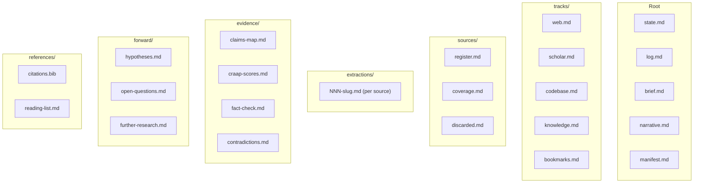

# Artifact Schema

## Design Principle

v2 splits monolithic artifacts into focused sub-artifacts. No single output file should exceed ~200 lines. This keeps each artifact readable, diffable, and independently queryable.

## Session File Map

## Sub-Artifact Ownership

| Folder       | Producing Agent                                   | Gate   |
| ------------ | ------------------------------------------------- | ------ |
| tracks/      | dk.v2.gather-\*                                   | Gate 1 |
| sources/     | dk.v2.process                                     | Gate 2 |
| extractions/ | dk.v2.extract                                     | Gate 3 |
| evidence/    | dk.v2.evaluate-evidence, dk.v2.evaluate-factcheck | Gate 4 |
| references/  | dk.v2.cite                                        | Gate 4 |
| forward/     | dk.v2.synthesize-forward                          | Gate 5 |
| brief.md     | dk.v2.synthesize-brief                            | Gate 5 |
| narrative.md | dk.v2.synthesize-narrative                        | Gate 5 |
| manifest.md  | dk.v2.orchestrator                                | Gate 5 |

## Source ID Convention

Each track uses a prefix to avoid ID collisions:

| Track     | Prefix | Example    |
| --------- | ------ | ---------- |
| Web       | S-W    | S-W1, S-W2 |
| Scholar   | S-A    | S-A1, S-A2 |
| Codebase  | S-C    | S-C1, S-C2 |
| Knowledge | S-K    | S-K1, S-K2 |
| Bookmarks | S-B    | S-B1, S-B2 |

After deduplication in process phase, sources get a unified ID (S1, S2, ...) in `sources/register.md`.

## Cross-References

Sub-artifacts reference each other using:

- Source IDs: `S{N}` (from register)
- Claim IDs: `C{N}` (from claims-map)
- Hypothesis IDs: `H{N}` (from hypotheses)
- Question IDs: `Q{N}` (from open-questions)
- Follow-up IDs: `FR{N}` (from further-research)
- Contradiction IDs: `X{N}` (from contradictions)
- Fact-check IDs: `F{N}` (from fact-check)
