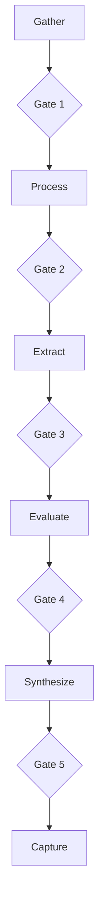

# Quality Gates Reference

Gates prevent low-quality output from propagating. Each phase amplifies previous weaknesses — gates break this cascade.

## Pipeline Flow



## Gate Details

### Gate 1: Source Sufficiency

| Criterion              | Default | Rationale                      |
| ---------------------- | ------- | ------------------------------ |
| min_sources ≥ 15       | 15      | Triangulation requires breadth |
| min_categories ≥ 3     | 3       | Avoid single-perspective bias  |
| all_dimensions_covered | true    | Prevent blind spots            |

### Gate 2: Source Quality

| Criterion          | Default | Rationale                     |
| ------------------ | ------- | ----------------------------- |
| register_complete  | true    | Every source must be rated    |
| min_tier_1_2 ≥ 3   | 3       | High-quality evidence anchors |
| duplicates_removed | true    | Clean register                |

### Gate 3: Extraction Complete

| Criterion          | Default | Rationale                        |
| ------------------ | ------- | -------------------------------- |
| all_T1–3_extracted | true    | Important sources get deep reads |
| pdfs_analyzed      | true    | Academic papers fully processed  |

### Gate 4: Evaluation Complete

| Criterion                 | Default | Rationale                 |
| ------------------------- | ------- | ------------------------- |
| claims_map_created        | true    | Claims mapped to evidence |
| citations_generated       | true    | Academic integrity        |
| fact_check_present        | true    | Key claims verified       |
| contradictions_identified | true    | Disagreements surfaced    |

### Gate 5: Output Complete

| Criterion               | Default | Rationale             |
| ----------------------- | ------- | --------------------- |
| required_artifacts      | 6 files | Consistent output set |
| narrative_has_citations | true    | Claims traceable      |

## Customization

### Lower thresholds (niche topics)

```yaml
gates:
  gate_1:
    criteria: { min_sources: 8, min_source_categories: 2 }
```

### Disable a gate

```yaml
pipeline:
  phases:
    - id: process
      gate: null
```

### Add custom gate

```yaml
gates:
  gate_custom:
    name: "My Check"
    criteria: { my_criterion: true }
    on_fail: warn_and_continue
```
