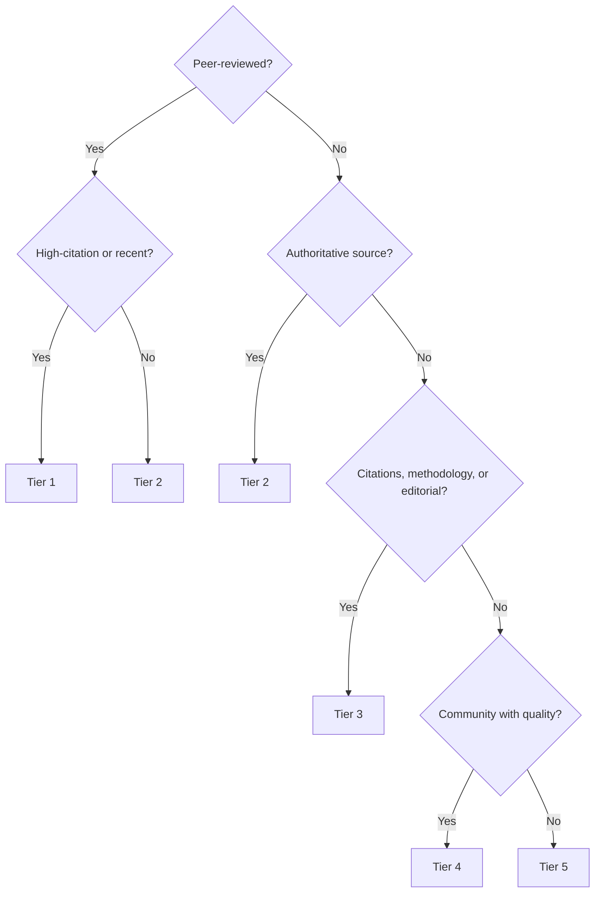

# Source Quality Rating

## 5-Tier System

### Tier 1 — Gold Standard

Peer-reviewed at top venues, high citation count (100+ recent, 500+ older), clear methodology, reproducible.
**Trust**: Cite directly.

### Tier 2 — Authoritative

Official docs, standards bodies, established technical blogs with editorial process, known experts.
**Trust**: Cite directly. Cross-check critical technical claims.

### Tier 3 — Substantive

arXiv preprints, industry reports (Gartner, Forrester), well-sourced blog posts, conference talks.
**Trust**: Cite with caveat. Cross-reference key claims with T1–2.

### Tier 4 — Supplementary

Community content, tutorials, Stack Overflow, Medium posts, YouTube.
**Trust**: Context only. Follow to their sources.

### Tier 5 — Discard

Marketing, product pages, press releases, unsourced opinion, SEO content.
**Trust**: Do not cite. Do not include in evidence map.

## Decision Tree

