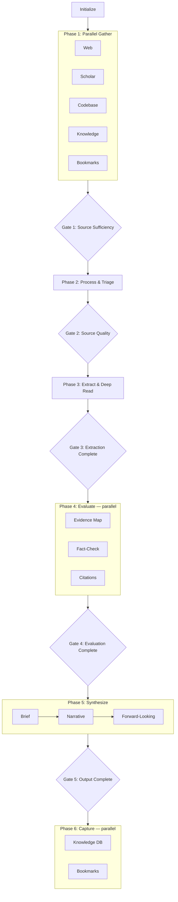

# Deep Research v2

## When to Use

- Researching any topic requiring multiple sources
- Literature reviews or evidence synthesis
- Technical questions with academic + web sources
- Any request: "research", "investigate", "literature review", "deep dive"

## Pipeline



## Session Output Structure

```
session-folder/
├── state.md                  ← lightweight IPC
├── log.md                    ← lean phase log
├── brief.md                  ← executive summary
├── narrative.md              ← full synthesis with citations
├── manifest.md               ← session inventory
├── tracks/                   ← raw gather data (audit trail)
│   ├── web.md
│   ├── scholar.md
│   ├── codebase.md
│   ├── knowledge.md
│   └── bookmarks.md
├── sources/                  ← source management
│   ├── register.md           ← rated source register
│   ├── coverage.md           ← dimension coverage
│   └── discarded.md          ← dropped sources + reasons
├── extractions/              ← per-source deep reads
│   └── {NNN}-{slug}.md
├── evidence/                 ← evaluation sub-artifacts
│   ├── claims-map.md         ← claims → evidence → confidence
│   ├── craap-scores.md       ← per-source CRAAP scores
│   ├── fact-check.md         ← fact-check verdicts
│   └── contradictions.md     ← contradiction analysis
├── forward/                  ← forward-looking research
│   ├── hypotheses.md
│   ├── open-questions.md
│   └── further-research.md
├── references/               ← citation management
│   ├── citations.bib
│   └── reading-list.md
└── diagrams/                 ← optional (draw.io on request)
```

## Agents

| Agent                        | Phase | Parallel | Output                                    |
| ---------------------------- | ----- | -------- | ----------------------------------------- |
| `dk.v2.orchestrator`         | all   | —        | state.md, log.md, manifest.md             |
| `dk.v2.gather-web`           | 1     | yes      | tracks/web.md                             |
| `dk.v2.gather-scholar`       | 1     | yes      | tracks/scholar.md                         |
| `dk.v2.gather-codebase`      | 1     | yes      | tracks/codebase.md                        |
| `dk.v2.gather-knowledge`     | 1     | yes      | tracks/knowledge.md                       |
| `dk.v2.gather-bookmarks`     | 1     | yes      | tracks/bookmarks.md                       |
| `dk.v2.process`              | 2     | —        | sources/\*.md                             |
| `dk.v2.extract`              | 3     | —        | extractions/\*.md                         |
| `dk.v2.evaluate-evidence`    | 4     | yes      | evidence/claims-map.md, contradictions.md |
| `dk.v2.evaluate-factcheck`   | 4     | yes      | evidence/craap-scores.md, fact-check.md   |
| `dk.v2.cite`                 | 4     | yes      | references/_._                            |
| `dk.v2.synthesize-brief`     | 5     | —        | brief.md                                  |
| `dk.v2.synthesize-narrative` | 5     | —        | narrative.md                              |
| `dk.v2.synthesize-forward`   | 5     | yes      | forward/\*.md                             |
| `dk.v2.capture-knowledge`    | 6     | yes      | Zettelkasten notes                        |
| `dk.v2.capture-bookmarks`    | 6     | yes      | Bookmarks                                 |

## Quality Gates

| Gate | After Phase | Key Criteria                                            |
| ---- | ----------- | ------------------------------------------------------- |
| 1    | Gather      | ≥15 sources, ≥3 categories, all dimensions covered      |
| 2    | Process     | Register complete, ≥3 T1–2 sources, no duplicates       |
| 3    | Extract     | All T1–3 have extraction notes, PDFs analyzed           |
| 4    | Evaluate    | Claims map + citations + fact-check + contradictions    |
| 5    | Synthesize  | All required artifacts present, narrative has citations |

## Research Dimensions

Every session must cover:

1. **Historical Context** — how did we get here?
2. **Current State** — what works today?
3. **Key Players** — who is involved?
4. **Challenges** — what doesn't work?
5. **Future Directions** — where is this going?

## Key v2 Changes from v1

| Aspect              | v1                   | v2                                                         |
| ------------------- | -------------------- | ---------------------------------------------------------- |
| Evidence evaluation | 1 monolithic agent   | Split: evidence-map + fact-check                           |
| Synthesis           | 1 monolithic agent   | Split: brief + narrative + forward                         |
| Source management   | 1 file (1000+ LOC)   | 3 sub-artifacts: register, coverage, discarded             |
| Evidence output     | 1 file (364 LOC)     | 4 sub-artifacts: claims, craap, fact-check, contradictions |
| Mermaid diagrams    | Left-right (LR)      | Top-down (TB)                                              |
| draw.io             | Generated by default | Optional, on request only                                  |
| Track preservation  | NW style             | Preserved in tracks/                                       |
| Paper deep-dive     | OPS Pacheco-Vega     | Included in extract agent                                  |
| Forward research    | OPS 3-file split     | hypotheses + questions + further-research                  |
| Citations           | NW BibTeX            | Dedicated cite agent                                       |
