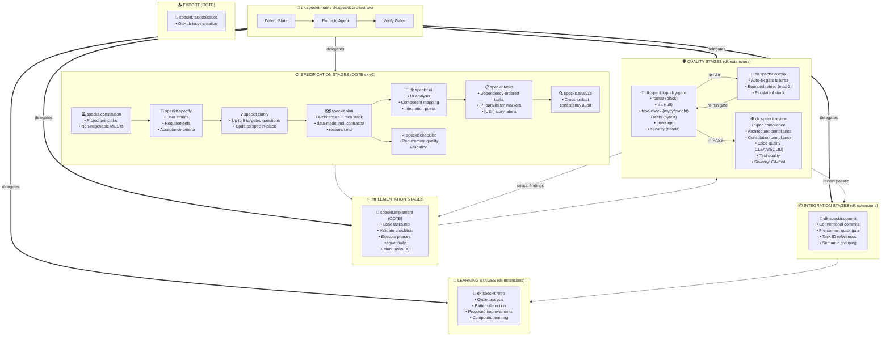
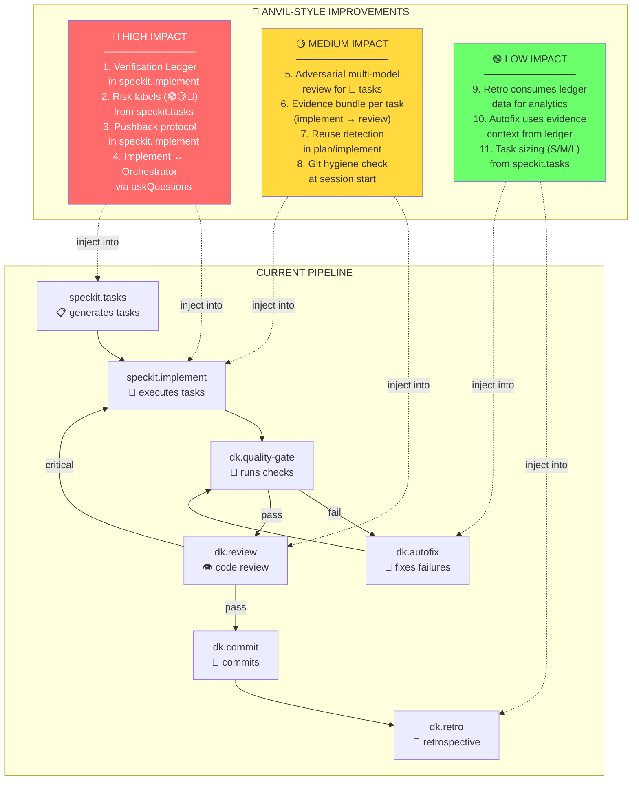
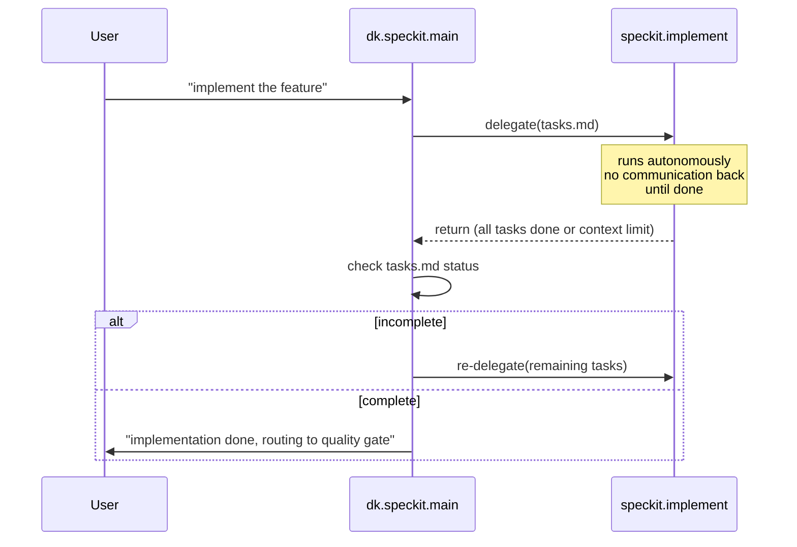
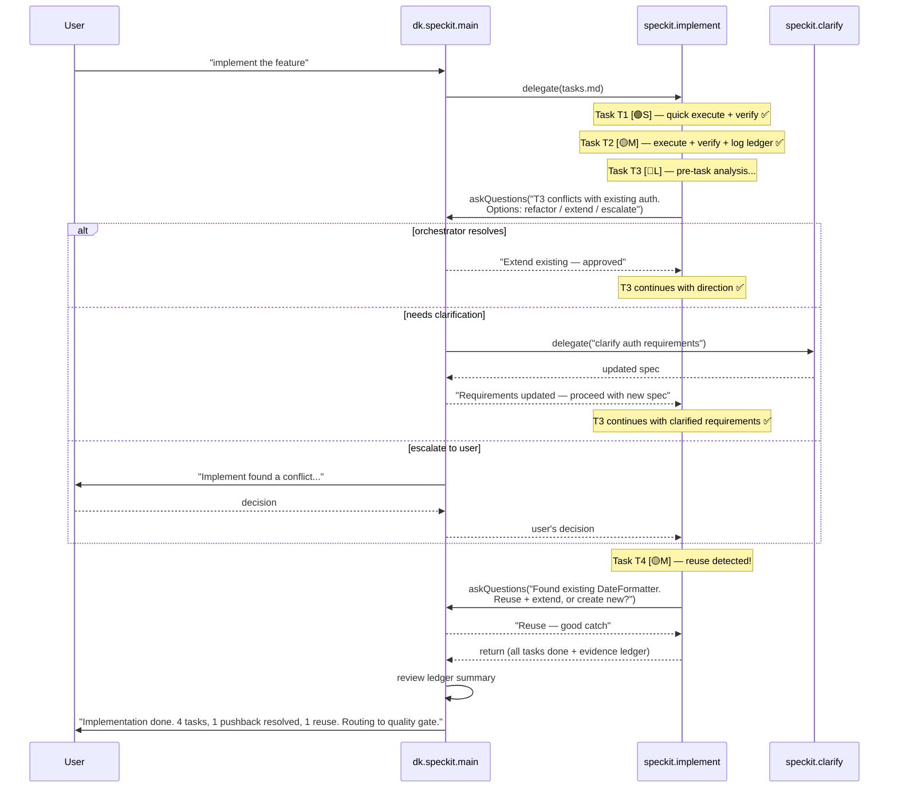
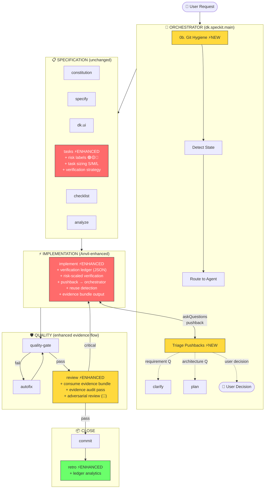

# Spec-Kit + Anvil Integration Map

**Date**: 2026-03-12
**Purpose**: Visualize the full spec-kit pipeline (OOTB sk-v1 + dk.speckit.\* extensions), and highlight where Anvil-style improvements add the most value.

---

## 1. Full Pipeline — OOTB + dk Extensions



---

## 2. Agent Inventory — Who Does What

### OOTB sk-v1 Agents (10)

| Agent                   | Stage  | Role                            | Writable Artifacts                                      |
| ----------------------- | ------ | ------------------------------- | ------------------------------------------------------- |
| `speckit.constitution`  | 1      | Establish project principles    | `constitution.md`                                       |
| `speckit.specify`       | 2      | Define requirements & stories   | `spec.md`                                               |
| `speckit.clarify`       | 2b     | Resolve ambiguities via Q&A     | Updates `spec.md`                                       |
| `speckit.plan`          | 3      | Technical design & architecture | `plan.md`, `data-model.md`, `contracts/`, `research.md` |
| `speckit.tasks`         | 4      | Actionable task breakdown       | `tasks.md`                                              |
| `speckit.checklist`     | X-cut  | Requirement quality validation  | `checklists/`                                           |
| `speckit.analyze`       | X-cut  | Cross-artifact consistency      | Analysis report                                         |
| `speckit.implement`     | 5      | Execute tasks from tasks.md     | Source code, tests                                      |
| `speckit.review`        | 6      | Code review → review artifacts  | `reviews/` (6 files)                                    |
| `speckit.taskstoissues` | Export | Convert tasks to GitHub issues  | GitHub issues                                           |

### dk.speckit.\* Extensions (8)

| Agent                     | Stage | Role                                   | Writable Artifacts                                        |
| ------------------------- | ----- | -------------------------------------- | --------------------------------------------------------- |
| `dk.speckit.main`         | Orch  | Lifecycle orchestrator (GPT-5)         | Status reports                                            |
| `dk.speckit.orchestrator` | Orch  | State detection & routing (Sonnet 4.6) | Status reports                                            |
| `dk.speckit.quality-gate` | 6     | Run automated checks                   | `gate-report.md`                                          |
| `dk.speckit.autofix`      | 6b    | Fix gate failures (bounded)            | Source code fixes                                         |
| `dk.speckit.review`       | 7     | Enhanced structured review             | `review-report.md`, `reviews/`                            |
| `dk.speckit.commit`       | 8     | Conventional commits                   | Git commits                                               |
| `dk.speckit.retro`        | 9     | Compound learning cycle                | `retro.md`                                                |
| `dk.speckit.ui`           | 3b    | UI requirements analysis               | `ui-analysis.md`, `ui-components.md`, `ui-integration.md` |

---

## 3. Anvil Integration Points — Where Evidence-First Helps



---

## 4. Detailed Integration Map — Agent × Anvil Feature

### 🔴 HIGH IMPACT — Inject into `speckit.implement`

```
┌─────────────────────────────────────────────────────────────────┐
│                    speckit.implement (CURRENT)                  │
│                                                                 │
│  1. Load tasks.md                                               │
│  2. Validate checklists                                         │
│  3. For each task:                                              │
│     • Execute implementation                                    │
│     • Mark [X] when done                                        │
│  4. Report completion                                           │
│                                                                 │
│  GAP: No in-flight verification, no pushback, no risk scaling   │
└─────────────────────────────────────────────────────────────────┘
                              │
                              ▼
┌─────────────────────────────────────────────────────────────────┐
│              speckit.implement (ANVIL-ENHANCED)                 │
│                                                                 │
│  1. Load tasks.md                                               │
│  2. Validate checklists                                         │
│  ┌─── NEW: Pre-execution checkpoint ───────────────────────┐   │
│  │ • Scan for reuse opportunities (grep existing codebase)  │   │
│  │ • Evaluate overall scope — pushback if too vague/large   │   │
│  │ • If pushback needed → askQuestions to orchestrator       │   │
│  └──────────────────────────────────────────────────────────┘   │
│  3. For each task:                                              │
│     ┌── NEW: Read risk label (🟢🟡🔴) from tasks.md ──┐       │
│     │                                                    │       │
│     │  🟢 Green: Implement → quick verify (lint+test)    │       │
│     │  🟡 Yellow: Implement → verify → log to ledger     │       │
│     │  🔴 Red: Pushback → implement → deep verify        │       │
│     │          → adversarial self-review → log ledger     │       │
│     └────────────────────────────────────────────────────┘       │
│     • Execute implementation                                    │
│     ┌── NEW: Per-task verification ─────────────────────┐       │
│     │  Run targeted tests for changed files              │       │
│     │  Check IDE diagnostics (0 errors)                  │       │
│     │  Log result → evidence ledger (JSON)               │       │
│     └────────────────────────────────────────────────────┘       │
│     • Mark [X] when VERIFIED (not just "done")                  │
│     ┌── NEW: Mid-task pushback (if issues) ─────────────┐       │
│     │  "This task conflicts with existing code in X"     │       │
│     │  "Requirements have edge case Y"                   │       │
│     │  → askQuestions to orchestrator for routing         │       │
│     └────────────────────────────────────────────────────┘       │
│  4. Emit evidence bundle → consumed by dk.review                │
│  5. Report completion + ledger summary                          │
│                                                                 │
└─────────────────────────────────────────────────────────────────┘
```

### 🔴 HIGH IMPACT — Inject into `speckit.tasks`

```
┌─────────────────────────────────────────────────────────────────┐
│                    speckit.tasks (CURRENT)                      │
│                                                                 │
│  Task format:                                                   │
│  - [ ] [T1] [P] [US1] Description with file path               │
│                                                                 │
│  Labels: [P] = parallelizable, [USn] = user story               │
│  Missing: risk classification, task sizing                      │
└─────────────────────────────────────────────────────────────────┘
                              │
                              ▼
┌─────────────────────────────────────────────────────────────────┐
│               speckit.tasks (ANVIL-ENHANCED)                    │
│                                                                 │
│  Task format:                                                   │
│  - [ ] [T1] [P] [US1] [🟢S] Description with file path         │
│  - [ ] [T2] [US1] [🟡M] Modify existing business logic         │
│  - [ ] [T3] [US2] [🔴L] Implement auth token refresh           │
│                                                                 │
│  NEW labels:                                                    │
│  • Risk: 🟢 additive/config/docs                                │
│          🟡 modify business logic/signatures/queries             │
│          🔴 auth/crypto/payments/deletion/schema/public-API      │
│  • Size: S = one-liner/config                                    │
│          M = single-concern change                               │
│          L = multi-file/architecture                             │
│                                                                 │
│  NEW section in tasks.md:                                       │
│  ## Verification Strategy                                       │
│  | Risk | Verification Depth | Reviewers |                     │
│  |------|-------------------|-----------|                       │
│  | 🟢   | Quick (lint+test) | 0         |                      │
│  | 🟡   | Standard (full)   | 1 (self)  |                      │
│  | 🔴   | Deep + adversarial| 1-3       |                      │
└─────────────────────────────────────────────────────────────────┘
```

### 🟡 MEDIUM IMPACT — Enhance `dk.speckit.review`

```
┌─────────────────────────────────────────────────────────────────┐
│                    dk.speckit.review (CURRENT)                  │
│                                                                 │
│  • Single-agent review pass                                     │
│  • Reconstructs evidence post-hoc by reading code               │
│  • Produces review-report.md + supporting artifacts             │
│  • Severity classification: Critical/Major/Minor/Info           │
│                                                                 │
│  GAP: No evidence from implementation, no adversarial pass      │
└─────────────────────────────────────────────────────────────────┘
                              │
                              ▼
┌─────────────────────────────────────────────────────────────────┐
│              dk.speckit.review (ANVIL-ENHANCED)                 │
│                                                                 │
│  NEW Step 0: Load evidence bundle from implement                │
│  • Read verification ledger (JSON)                              │
│  • Identify which tasks were 🔴 risk                            │
│  • Check: did implement actually verify each task?              │
│  • Missing ledger entries = automatic MAJOR finding             │
│                                                                 │
│  Existing passes: Spec, Architecture, Constitution, Quality...  │
│                                                                 │
│  NEW Pass G: Evidence Audit                                     │
│  • For each 🟡🔴 task, verify ledger shows:                     │
│    - Tests ran and passed                                       │
│    - IDE diagnostics clean                                      │
│    - No skipped verification steps                              │
│  • Flag any "self-reported OK" without tool evidence            │
│                                                                 │
│  NEW: Adversarial review for 🔴 tasks                           │
│  • Switch to different model for 🔴 file review                 │
│  • Specifically challenge: auth logic, data deletion,           │
│    schema changes, public API surface                           │
│  • Merge adversarial findings into review-report.md             │
│                                                                 │
└─────────────────────────────────────────────────────────────────┘
```

### 🟡 MEDIUM IMPACT — Enhance `dk.speckit.main` / `dk.speckit.orchestrator`

```
┌─────────────────────────────────────────────────────────────────┐
│              dk.speckit.main (ANVIL-ENHANCED)                   │
│                                                                 │
│  NEW Step 0b: Git Hygiene (from Anvil)                          │
│  ┌───────────────────────────────────────────────────────┐      │
│  │ At session start:                                      │      │
│  │ • Check git status --porcelain                         │      │
│  │ • If dirty: warn user → commit/stash/ignore            │      │
│  │ • If on main for non-trivial work: suggest branch      │      │
│  └───────────────────────────────────────────────────────┘      │
│                                                                 │
│  NEW: Receive pushback escalations from implement               │
│  ┌───────────────────────────────────────────────────────┐      │
│  │ implement → askQuestions → orchestrator:                │      │
│  │                                                        │      │
│  │ "Task T3 conflicts with existing auth in users.py.     │      │
│  │  Options: (A) Refactor existing, (B) Extend existing,  │      │
│  │  (C) Escalate to user"                                 │      │
│  │                                                        │      │
│  │ Orchestrator can:                                      │      │
│  │ • Route to speckit.clarify for requirement update      │      │
│  │ • Approve option A or B directly                       │      │
│  │ • Escalate to user via askQuestions                     │      │
│  └───────────────────────────────────────────────────────┘      │
│                                                                 │
│  NEW: Consume ledger summary for routing decisions              │
│  • If implement reports many 🔴 verification failures           │
│    → route to review with "high-scrutiny" flag                  │
│  • If implement pushback count > 2                              │
│    → suggest re-planning via speckit.plan                       │
│                                                                 │
└─────────────────────────────────────────────────────────────────┘
```

---

## 5. The askQuestions ↔ Orchestrator Pattern

This is the most architecturally interesting Anvil-inspired change. Currently, the pipeline is **strictly sequential**: orchestrator delegates → agent runs to completion → orchestrator checks results. Anvil's pushback protocol creates a need for **mid-execution communication**.

### Current Flow (fire-and-forget)



### Anvil-Enhanced Flow (bidirectional during execution)



### Why This Pattern Makes Sense

| Aspect                  | Current (fire-and-forget)                              | Anvil-Enhanced (bidirectional)           |
| ----------------------- | ------------------------------------------------------ | ---------------------------------------- |
| **Conflict detection**  | Discovered post-hoc in review                          | Caught during implementation             |
| **Reuse opportunities** | Missed — implement doesn't look                        | Discovered and applied inline            |
| **Requirements gaps**   | Silently guessed or skipped                            | Escalated to clarify agent               |
| **User visibility**     | Black box until done                                   | Progressive status via orchestrator      |
| **Wasted work**         | Implements wrong thing → review catches → reimplements | Stops before wrong implementation starts |
| **Orchestrator role**   | Passive (check after done)                             | Active (triage mid-execution)            |

### Implementation Considerations

1. **askQuestions is already in the orchestrator's toolset** — both `dk.speckit.main` and `dk.speckit.orchestrator` have `agent/askQuestions`. The implement agent would need it added too.

2. **Frequency budget** — pushback should be rare (1-2 per cycle), not on every task. Only trigger for:
   - 🔴 risk tasks (always evaluate before executing)
   - Reuse opportunities that affect multiple tasks
   - Requirement contradictions discovered during implementation
   - Scope that exceeds the task description

3. **Orchestrator as triage** — the orchestrator doesn't need to solve problems, just route them:
   - Implementation question → approve or pick option
   - Requirement question → route to `speckit.clarify`
   - Architecture question → route to `speckit.plan`
   - User decision needed → escalate with context

---

## 6. What NOT to Change

These agents should NOT receive Anvil-style modifications:

| Agent                   | Reason                                                                                                                     |
| ----------------------- | -------------------------------------------------------------------------------------------------------------------------- |
| `speckit.clarify`       | Already does requirements-level pushback well. Anvil pushback is execution-time; clarify is spec-time. Different concerns. |
| `speckit.checklist`     | Validates requirement _quality_, not implementation. Orthogonal to evidence-first execution.                               |
| `speckit.constitution`  | Defines principles — no execution rigor needed.                                                                            |
| `speckit.specify`       | Creates specs — verification ledgers are for code, not requirements prose.                                                 |
| `speckit.taskstoissues` | Pure export. No implementation to verify.                                                                                  |
| `dk.speckit.commit`     | Already has pre-commit gate. Adding verification ledger here is redundant — the evidence was collected during implement.   |

---

## 7. Priority-Ordered Implementation Plan

### Phase 1: Foundation (enable everything else)

1. **`speckit.tasks`** — Add risk labels and task sizing to task format
2. **`speckit.implement`** — Add verification ledger (JSON), risk-scaled verification, pushback protocol with askQuestions

### Phase 2: Evidence Flow

3. **`dk.speckit.review`** — Consume evidence bundle from implement, add Evidence Audit pass
4. **`dk.speckit.main`** — Add git hygiene at session start, handle pushback routing from implement

### Phase 3: Depth

5. **`dk.speckit.review`** — Add adversarial multi-model review for 🔴 tasks
6. **`dk.speckit.retro`** — Consume verification ledger data for cycle analytics
7. **`speckit.plan`** — Add "Verification Strategy" and "Reuse Opportunities" sections

---

## 8. Evidence Ledger Format (JSON, not SQL)

Anvil uses SQLite. For spec-kit, a JSON file per spec is lighter and artifact-friendly:

**Location**: `specs/<NNN>-<name>/evidence-ledger.json`

```json
{
  "spec": "003-feature-name",
  "created": "2026-03-12T10:00:00",
  "tasks": [
    {
      "task_id": "T1",
      "risk": "🟢",
      "size": "S",
      "verifications": [
        {
          "phase": "after",
          "check": "lint",
          "tool": "ruff check",
          "passed": true,
          "timestamp": "2026-03-12T10:05:00"
        },
        {
          "phase": "after",
          "check": "test",
          "tool": "pytest tests/test_feature.py -x",
          "passed": true,
          "output_snippet": "3 passed in 0.4s",
          "timestamp": "2026-03-12T10:05:30"
        }
      ],
      "pushbacks": [],
      "reuse_detected": null
    },
    {
      "task_id": "T3",
      "risk": "🔴",
      "size": "L",
      "verifications": [
        {
          "phase": "baseline",
          "check": "test",
          "tool": "pytest tests/ -x",
          "passed": true,
          "output_snippet": "42 passed in 2.1s",
          "timestamp": "2026-03-12T10:10:00"
        },
        {
          "phase": "after",
          "check": "test",
          "tool": "pytest tests/ -x",
          "passed": true,
          "output_snippet": "45 passed in 2.3s",
          "timestamp": "2026-03-12T10:25:00"
        },
        {
          "phase": "review",
          "check": "adversarial",
          "tool": "multi-model review (GPT-5)",
          "passed": true,
          "output_snippet": "No critical findings",
          "timestamp": "2026-03-12T10:26:00"
        }
      ],
      "pushbacks": [
        {
          "reason": "Task conflicts with existing auth in users.py",
          "resolution": "Extend existing — approved by orchestrator",
          "timestamp": "2026-03-12T10:12:00"
        }
      ],
      "reuse_detected": null
    }
  ]
}
```

---

## 9. Summary Diagram — Full Anvil-Enhanced Pipeline



**Legend**: 🔴 Red = High-impact Anvil changes | 🟡 Yellow = Medium-impact | 🟢 Green = Low-impact | Unchanged = default style
